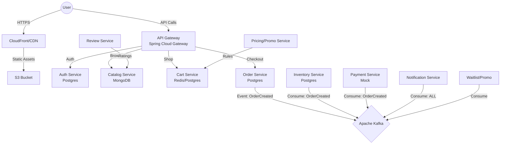

# KinaNow (Buy Now) 🛍️

**KinaNow** is a production-grade, microservices-based E-commerce platform built with **Angular 19+** and **Spring Boot 3.x**. It emulates core Amazon features like product catalog, cart, checkout, order tracking, and inventory management.

> **Note**: This project is designed for Enterprise Java interviews, deep learning of Spring Boot Microservices, Event-Driven Architecture (Kafka), and DevOps practices.

---

## 🏗️ Architecture

The system follows a **Microservices Architecture** with Event-Driven communication.



### Core Services
| Service | Tech Stack | Responsibility | Port |
|---------|------------|----------------|------|
| **Gateway** | Spring Cloud Gateway | Routing, Rate Limiting, Auth Handoff | 8080 |
| **Config Server** | Spring Cloud Config | Centralized Configuration | 8888 |
| **Auth Service** | Spring Security, JWT, Postgres | Users, Roles (Admin/Seller/Cust), Tokens | 8081 |
| **Catalog Service** | MongoDB, Spring Data Mongo | Products, Categories, Search | 8082 |
| **Pricing Service** | JPA, Postgres | Coupons, Dynamic Pricing Rules | 8083 |
| **Cart Service** | JPA, Postgres | Shopping Cart Management | 8084 |
| **Order Service** | JPA, Postgres, Kafka | Order State Machine, Checkout | 8085 |
| **Payment Service** | Mock Integration | Mock Payments, Transaction Logs | 8086 |
| **Inventory Service** | JPA, Postgres | Stock Management, Optimistic Locking | 8087 |
| **Notification** | Kafka Consumer, JavaMail | Email/SMS Notifications | 8088 |
| **Review Service** | JPA, Postgres | Product Reviews, Ratings | 8089 |
| **Admin Service** | JPA, Postgres | Back-office management, KPIs | 8090 |

---

## 🛠️ Tech Stack

### Backend
*   **Language**: Java 17+
*   **Framework**: Spring Boot 3.3.x, Spring Cloud 2023.x
*   **Database**: PostgreSQL 16 (Transactional), MongoDB 7 (Catalog)
*   **Messaging**: Apache Kafka (Event Sourcing)
*   **Security**: Spring Security 6, OAuth2 Resource Server (JWT)
*   **Testing**: JUnit 5, Mockito, Testcontainers, RestAssured
*   **Build**: Maven (Multi-module)

### Frontend
*   **Framework**: Angular 18+ (Latest)
*   **Styling**: Tailwind CSS
*   **State**: NgRx
*   **HTTP**: Interceptors for JWT Refresh

### DevOps
*   **Containerization**: Docker, Docker Compose
*   **CI/CD**: GitHub Actions (planned)
*   **Monitoring**: Prometheus, Grafana, Zipkin (Tracing)

---

## 🚀 Getting Started

### Prerequisites
*   Java 17+ SDK
*   Node.js 20+ & npm
*   Docker & Docker Compose
*   Maven 3.9+

### Running Infrastructure
Start the supporting infrastructure (DBs, Broker):
```bash
docker-compose up -d
```

### Running Backend Services
You can run services individually via Maven or IDE.
Order of startup:
1.  **Config Server**
2.  **Discovery Server** (if used, or Gateway)
3.  **API Gateway**
4.  **Auth Service**
5.  ...others...

### Running Frontend
```bash
cd frontend/kinanow-angular
npm install
npm start
```
Access the app at `http://localhost:4200`

---

## 🧪 Testing strategy
*   **Unit**: `@Test` with Mockito for Service layer logic.
*   **Integration**: `@SpringBootTest` with Testcontainers (Postgres/Kafka) for Repositories and Controllers.
*   **E2E**: Cypress/Playwright (Frontend).

---

## 📈 Kafka Event Flow
*   `kinanow-order-events`: OrderCreated, OrderPaid, OrderShipped, OrderCancelled
*   `kinanow-payment-events`: PaymentSucceeded, PaymentFailed
*   `kinanow-inventory-events`: StockReserved, StockReleased, StockDepleted
*   `kinanow-notification-events`: SendEmail, SendSms

---
**Author**: Narayan Bhattarai
